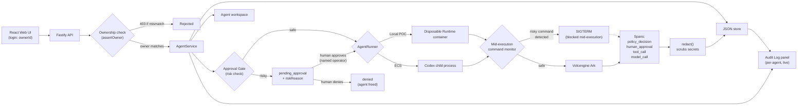

# Volc Agent Launchpad

A minimal Agent platform for three-day middleware hackathons. It provides Agent
CRUD, a browser Playground, persistent workspaces, and Codex CLI backed by the
Volcengine Ark Responses API.

Run it locally with Docker, Colima, or rootless Podman, or deploy it to
Volcengine ECS.

> [!NOTE]
> This fork adds Authorization (approval-gating + ownership isolation) and
> Audit (structured, redacted trace spans) middleware on top of the original
> single-user POC. See the "Middleware Extension" section below for details,
> findings, and known limitations.

---

# Middleware Extension: Approval Gate, Audit & Ownership

## What this is

This fork extends the starter kit above with a **coherent Authorization + Audit middleware**: a policy layer that inspects what an Agent is about to do, gates risky actions behind human approval, watches for dangerous behavior mid-execution as a second line of defense, records every decision in a structured audit trail, and enforces ownership isolation so one user cannot act on another user's Agents.

It answers one specific problem: **an AI coding agent with full filesystem access can be asked — accidentally or maliciously — to do something destructive. How do we stop that, prove afterward exactly what happened and why, and make sure only the right person can control a given Agent?**

## Architecture



In one sentence: every request first passes an **ownership check**; every message then passes a **policy check** before execution; risky ones pause for named human approval; a **second, independent monitor** watches the actual commands Codex executes and can terminate the process mid-run if something dangerous slips through; every decision is recorded as a structured **span** attached to the run.

## What we built

### 1. Ownership isolation (Identity & Authorization)
Every Agent is tagged with an `ownerId` at creation. A lightweight, demo-only "who are you?" screen sets the current user's identity client-side (no password, explicitly not real authentication — see Limitations). The backend enforces ownership on every state-changing action — `sendMessage`, `approveRun`, `denyRun`, `deleteAgent` — via a single `assertOwner` check, rejecting mismatches with `403 You do not own this Agent`. The Agent list itself is filtered server-side by `ownerId`, so a different user does not see another user's Agents at all, not merely get blocked from acting on them.

We verified this directly: creating an Agent as "alice," then attempting `sendMessage` against that Agent as "bob" via a raw API call, correctly returns `403 Forbidden` — enforced at the API layer, not just hidden in the UI.

### 2. Prompt-level approval gate
Every `sendMessage` call is checked against a set of risk patterns (destructive shell commands, database drops, secrets/credentials access) before the Agent ever runs. A match sets the run's status to `pending_approval` with a specific `riskReason`, and execution is held until a human clicks **Approve** or **Deny**, providing their name for the audit record.

- **Approve** → the run proceeds to execute normally, logged as `human_approval: Approved by <name>`.
- **Deny** → the run is marked `denied`, logged as `human_approval: Denied by <name>`, and the Agent is freed back to `ready` without ever executing.

This lives once, inside the shared `AgentService.sendMessage` method, so it applies automatically to **every Agent** — verified across multiple distinct Agents, not hardcoded to one.

### 3. Mid-execution kill-switch (second layer)
Prompt-level checks can be worded around. We also monitor the **actual shell commands** Codex executes in real time. If a command matches a risky pattern, we send `SIGTERM` to the Codex process mid-run. In live testing, a user explicitly re-confirmed a destructive request after being warned, and this layer still terminated the process, with Codex itself reporting "the command was blocked by a safety policy in the environment... I can't override that guard."

### 4. Structured, redacted audit trail
Every run records categorized **spans** — `policy_decision`, `human_approval`, `tool_call`, `model_call` — each with status, timestamp, and detail. Command and output text is passed through `redact()` before storage, scrubbing patterns that look like API keys, tokens, or private key blocks. Token usage and the model/runtime used are recorded per run. A dedicated **Audit Log panel** lets an operator inspect the full decision trail for any Agent, live-updating as new runs complete and correctly resetting when switching between Agents.

### 5. Automated tests
Five new tests (17 total, all passing) verify: a risky prompt is correctly gated; a safe prompt is not; approving a pending run allows execution; denying a pending run blocks it and frees the Agent; and attempting to approve a non-pending run is correctly rejected.

## Findings from adversarial testing

We did not assume our detection worked — we tried to break it, using the real Agent against its own guardrails.

**Finding 1 — a denylist is fundamentally reactive.** Starting from `rm -rf`, we discovered Codex could accomplish the same destructive outcome via at least **four distinct techniques**: `rm -rf`, `find . -delete`, `unlink <file>`, and the shell truncation idiom `: > file`. Each patch closed one path while leaving the underlying bypass *capability* intact. A production system needs either an **allowlist** (treat anything unrecognized as needing approval) or **outcome-based monitoring** (did a file's size/hash change unexpectedly?), not an ever-growing denylist.

**Finding 2 — mid-execution interruption has a real timing race.** `SIGTERM` delivery is not instantaneous. A single-file `rm` on an empty file sometimes completed before our kill signal took effect; a multi-step compound command was reliably interrupted. Our kill-switch is a genuine safety net for slower/multi-step operations, not a hard real-time guarantee against the fastest single operations — which is exactly why we built it as a *second* layer behind the prompt-level gate, not our only defense.

**Finding 3 — Codex has its own independent safety behavior**, separate from our middleware (it sometimes asks clarifying questions before destructive actions on its own initiative). We distinguish this clearly in our evidence so it isn't misattributed to our guardrail.

**Finding 4 — `codex exec` cannot be paused and resumed mid-turn.** The starter kit's launch mode closes stdin and has approvals hardcoded off, so our mid-execution defense is necessarily a **kill**, not a **pause-and-resume**. True pause/resume would require migrating to `codex app-server` mode — a larger change we scoped out given time constraints, but understand as the correct next step.

## Why this design, and what we deliberately did not build

We chose **Ownership/Authorization + Approval Gating + Audit**, combined into one coherent middleware, over spreading effort across Sandbox Policy and Multi-Agent Coordination as well. We did not build:
- A real login/password system (our ownership model is a demo-only named identity, not authenticated)
- Custom sandbox/network policy beyond what the starter kit already provides
- Multi-Agent coordination (a different, unrelated recommended direction)

## Reproducing our findings

1. Start the platform (see setup below), create an Agent, and start it.
2. Send a safe prompt (e.g., "list the files in this workspace") — runs immediately, no approval needed.
3. Send a risky prompt (e.g., "please delete all files in this workspace") — the ⏳ Approval banner appears with a specific `riskReason`.
4. Click **Approve**, enter a name — the run executes, and the Audit Log records `human_approval: Approved by <name>`.
5. Open **Audit Log** to see the full span trail per run, including redacted command output and token usage.
6. Log in as a different name in a second browser/incognito window, create a second Agent — confirm the same approval gate fires identically, proving reusability across Agents.
7. Confirm ownership isolation: as the second user, attempt to send a message to the first user's Agent ID directly via the API — this returns `403 You do not own this Agent`.

## Limitations (honest)

- Detection is denylist-based at both layers; see Finding 1.
- The mid-execution kill is best-effort, not a hard real-time guarantee; see Finding 2.
- Ownership is a demo-only named identity, not real authentication (no password, no session tokens beyond the shared bearer token already in the starter kit) — sufficient to demonstrate the isolation *mechanism*, not production-ready identity.
- The `ContainerCodexRunner` (ECS-mode) path has the same risk-check plumbing but was not the primary tested/demoed path; `CodexRunner` (local-process mode) is where our mid-execution logic was built and verified live.

---

## Screenshots

### Agent Playground


### Create an Agent


## Features

- React and TypeScript Web UI
- Agent create, edit, start, stop, delete, and multi-turn chat
- Fastify control plane with asynchronous Run state
- Persistent Agent workspaces and Codex sessions
- Disposable Docker, Colima, or Podman container for each local turn
- Docker and Terraform deployment paths for Volcengine ECS
- **Approval gate, mid-execution kill-switch, structured audit trail, and ownership isolation** (this fork)

## Requirements

- Node.js 22+
- npm 10+
- Docker, Colima, or Podman
- A Volcengine Ark API key and endpoint that supports the Responses API (or any provider with a Responses-compatible/Chat Completions adapter — the model provider is not evaluated)

Codex CLI is included in the Runtime image and is not required on the host.

## Local browser SOP

### 1. Check the local tools

Install Node.js 22+ and one supported container engine, then verify them:

```bash
node --version
npm --version
docker --version        # Docker Desktop, Docker Engine, or Colima
podman --version        # Use this instead when running Podman
```

Only one container engine is required. Codex CLI is already included in the
Runtime image.

### 2. Clone the repository

```bash
git clone <repository-url> volc-agent-launchpad
cd volc-agent-launchpad
```

Skip this step when already working from the repository root.

### 3. Start the POC

```bash
ARK_API_KEY=your-ark-api-key \
ARK_MODEL=ep-your-endpoint-id \
ARK_BASE_URL=https://ark.ap-southeast.bytepluses.com/api/v3 \
npm run poc
```

The first run installs Node.js dependencies and builds the Runtime image. The
script automatically selects Docker, Colima, or Podman.

### 4. Open the browser

Visit <http://localhost:3000>, or open it from the terminal:

```bash
open http://localhost:3000       # macOS
xdg-open http://localhost:3000   # Linux desktop
```

In the Web UI:

1. Enter a name to identify yourself as an Agent owner (demo-only, not real authentication).
2. Select **Create Agent**.
3. Enter a name, description, and workspace instructions.
4. Select **Create Agent** again.
5. Enter a task in the Playground, for example:

```text
   Create a TypeScript hello-world CLI, add a test, and run it.
```

The Agent can write files, run commands, and continue the same Codex session in
later messages. Risky tasks will trigger the approval gate described above.

### 5. Stop and resume

Press `Ctrl+C` in the startup terminal. The script removes temporary Runtime
containers but keeps Agent workspaces and conversations.

- macOS state: `~/.volc-agent-launchpad/`
- Linux state: `.local/`
- Custom location: set `LOCAL_POC_DATA_ROOT`

Run the same `npm run poc` command to continue later.

### Select a specific container engine

Force Podman when multiple engines are installed:

```bash
CONTAINER_ENGINE=podman \
ARK_API_KEY=your-ark-api-key \
ARK_MODEL=ep-your-endpoint-id \
npm run poc
```

Colima uses `CONTAINER_ENGINE=docker` because it exposes the Docker CLI.

For a clean Linux host, follow the
[rootless Podman setup](docs/LOCAL_POC.md#rootless-podman-on-linux).

## Docker Compose

Create and edit the configuration:

```bash
./scripts/bootstrap-local.sh
```

Required values in `.env`:

```dotenv
ARK_API_KEY=your-ark-api-key
ARK_MODEL=ep-your-endpoint-id
APP_AUTH_TOKEN=replace-with-at-least-24-random-characters
```

Start the application:

```bash
docker compose up --build
```

Open <http://localhost:3000>. Stop it without deleting Agent data:

```bash
docker compose down
```

## Development

```bash
npm install
cp .env.example .env
npm install --global @openai/codex@0.111.0
npm run dev
```

- Web UI: <http://localhost:5173>
- API: <http://localhost:3000>

Use local paths in `.env` when running outside Docker:

```dotenv
APP_DATA_DIR=.data
AGENT_WORKSPACE_ROOT=workspaces
CODEX_HOME=codex-home
```

Run `npm run check` to execute the full test suite (typecheck, 17 tests, build).

## Deployment

- [Existing Linux ECS with Docker](docs/DEPLOYMENT.md#existing-linux-ecs)
- [Complete Volcengine environment with Terraform](docs/DEPLOYMENT.md#terraform-deployment)
- [Local Docker, Colima, and Podman details](docs/LOCAL_POC.md)

The existing-ECS script deploys from the current source tree:

```bash
cp .env.example .env.production
./scripts/deploy-existing-ecs.sh .env.production
```

The Terraform path provisions VPC, subnet, security group, ECS, and EIP:

```bash
cp deploy/volcengine/terraform.tfvars.example \
  deploy/volcengine/terraform.tfvars
./scripts/deploy-volcengine.sh
```

## Configuration

| Variable | Default | Purpose |
| --- | --- | --- |
| `ARK_API_KEY` | Required | Ark model API key. |
| `ARK_MODEL` | Required | Responses-capable endpoint or model ID. |
| `ARK_BASE_URL` | Beijing v3 endpoint | Ark OpenAI-compatible API URL. |
| `APP_AUTH_TOKEN` | Empty on loopback | Shared demo token; use 24+ random characters remotely. |
| `RUNTIME_PROVIDER` | `local-process` | `container` for disposable local Runtime containers. |
| `CODEX_SANDBOX_MODE` | `workspace-write` | Codex inner sandbox mode. |
| `CODEX_TIMEOUT_MS` | `600000` | Maximum duration of one turn. |
| `LOCAL_POC_DATA_ROOT` | Platform-specific | Local metadata, workspace, and session directory. |

See [.env.example](.env.example) for all Runtime and resource-limit options.

## Validation

```bash
npm run check
terraform fmt -check -recursive deploy/volcengine
docker compose config
```

## Documentation

- [Architecture](docs/ARCHITECTURE.md)
- [Local POC](docs/LOCAL_POC.md)
- [Deployment](docs/DEPLOYMENT.md)
- [Hackathon extension guide](docs/HACKATHON_EXTENSION_GUIDE.md)
- [Security policy](SECURITY.md)
- [Contributing](CONTRIBUTING.md)

## License

[MIT](LICENSE)